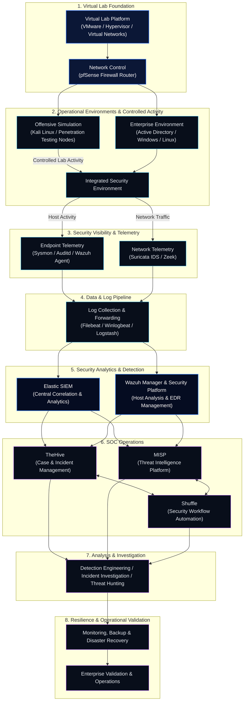

# Virtual Security Lab Architecture & Complete Setup Guide

A comprehensive, ground-up guide to building an isolated, dual-purpose SOC (Defensive) and Pentesting (Offensive) lab environment. From hypervisor deployment to telemetry pipelines and target node configurations.

  

    <strong style="color: var(--psv-text); display: block;">Hands-on Lab</strong>
    Real-world simulations
  

  

    <strong style="color: var(--psv-text); display: block;">SOC + Pentest</strong>
    Dual purpose environment
  

  

    <strong style="color: var(--psv-text); display: block;">End-to-end Guide</strong>
    From setup to detection
  

  

    <strong style="color: var(--psv-text); display: block;">Fully Isolated</strong>
    Safe &amp; controlled testing
  

---

<!-- INTEGRATED SECURITY LAB ARCHITECTURE -->
<section class="psv-home__arch-panel">
  

    

      <h2 style="font-size: 1.45rem; font-weight: 700; color: #FFFFFF; margin: 0 0 0.5rem 0;">Integrated Security Lab Architecture</h2>
      

        Logical capability architecture derived from the 30-phase security laboratory curriculum, illustrating telemetry collection, security operations, and operational resilience.
      

    

  

  <!-- Security Lifecycle Strip -->
  

    Security Lifecycle:
    

      Build
      →
      Attack
      →
      Detect
      →
      Investigate
      →
      Respond
      →
      Validate
      →
      Operate
    

  

  <!-- Logical Architecture Mermaid Diagram -->
  

  

  

Privacy Skill Vault Labs are built as an integrated security environment rather than a collection of isolated tutorials. The environment progresses from virtualization and enterprise infrastructure into security telemetry, offensive simulation, detection, investigation, threat intelligence, automation, resilience, and operational validation.
  

  <!-- Architecture Layer Breakdown Cards -->
  

  <h4>Foundation</h4>
  
Provides the virtualization, storage and networking platform on which the lab operates.

  <h4>Enterprise</h4>
  
Provides the systems and services that generate realistic authentication, process, network and operational activity.

  <h4>Visibility</h4>
  
Collects endpoint and network telemetry using the project's monitoring and logging components.

  <h4>Security Operations</h4>
  
Turns telemetry into detections, investigations, threat hunting and SOC workflows.

  <h4>Offensive Simulation</h4>
  
Produces controlled security activity that can be observed and detected.

  <h4>Intelligence &amp; Automation</h4>
  
Enriches security operations and automates selected workflows.

  <h4>Resilience</h4>
  
Monitors the environment and provides backup, recovery and operational validation.

  

</section>

## Lab Network Architecture &amp; Subnet Mapping

Multi-segmented, isolated environment for safe offensive testing and defensive monitoring.

  

    <h3 style="font-size: 1rem; margin-top: 0; margin-bottom: var(--psv-space-2);">Lab Network Architecture</h3>
    
Multi-segmented, isolated environment for safe offensive testing and defensive monitoring.

    

      <svg viewBox="0 0 500 220" style="width: 100%; min-width: 400px; height: auto; font-family: -apple-system, BlinkMacSystemFont, 'Segoe UI', Roboto, sans-serif;">
        <rect x="200" y="15" width="100" height="32" rx="5" fill="#0B1736" stroke="#38BDF8" stroke-width="1.5"/>
        <text x="250" y="35" fill="#FFFFFF" text-anchor="middle" font-size="10" font-weight="bold">pfSense Router</text>

        <line x1="250" y1="47" x2="90" y2="105" stroke="#38BDF8" stroke-width="1.5" stroke-dasharray="3"/>
        <line x1="250" y1="47" x2="250" y2="105" stroke="#10B981" stroke-width="1.5"/>
        <line x1="250" y1="47" x2="410" y2="105" stroke="#EF4444" stroke-width="1.5"/>

        <rect x="20" y="105" width="140" height="70" rx="5" fill="#050C21" stroke="#38BDF8" stroke-width="1"/>
        <text x="90" y="125" fill="#38BDF8" text-anchor="middle" font-size="10" font-weight="bold">SOC Segment</text>
        <text x="90" y="145" fill="#94A3B8" text-anchor="middle" font-size="9">10.0.20.0/24</text>
        <text x="90" y="160" fill="#64748B" text-anchor="middle" font-size="8">SIEM / Suricata IDS</text>

        <rect x="180" y="105" width="140" height="70" rx="5" fill="#050C21" stroke="#10B981" stroke-width="1"/>
        <text x="250" y="125" fill="#10B981" text-anchor="middle" font-size="10" font-weight="bold">Target Endpoints</text>
        <text x="250" y="145" fill="#94A3B8" text-anchor="middle" font-size="9">10.0.30.0/24</text>
        <text x="250" y="160" fill="#64748B" text-anchor="middle" font-size="8">Win AD DC / Win 11 / Linux</text>

        <rect x="340" y="105" width="140" height="70" rx="5" fill="#050C21" stroke="#EF4444" stroke-width="1"/>
        <text x="410" y="125" fill="#EF4444" text-anchor="middle" font-size="10" font-weight="bold">Attack Segment</text>
        <text x="410" y="145" fill="#94A3B8" text-anchor="middle" font-size="9">10.0.40.0/24</text>
        <text x="410" y="160" fill="#64748B" text-anchor="middle" font-size="8">Kali Linux / Commando VM</text>
      </svg>
    

  

  

    <h3 style="font-size: 1rem; margin-top: 0; margin-bottom: var(--psv-space-2);">Lab Subnet Mapping</h3>

    | Network Segment | Subnet / VLAN | Purpose |
    | :--- | :--- | :--- |
    | **WAN / Gateway** | `192.168.1.0/24` | Internet Egress |
    | **DMZ / Perimeter** | `10.0.10.0/24` | Public Services |
    | **Internal LAN / SOC** | `10.0.20.0/24` | Security Operations |
    | **Target Endpoints** | `10.0.30.0/24` | Victim Nodes |
    | **Attack Segment** | `10.0.40.0/24` | Isolated Testing |

    <h4 style="font-size: 0.875rem; color: var(--psv-text); margin-top: var(--psv-space-4); margin-bottom: var(--psv-space-2);">Key Objectives</h4>
    <ul>
      <li>Isolate attack traffic from SOC infrastructure</li>
      <li>Monitor all target network telemetry</li>
      <li>Practice real-world detection &amp; response</li>
      <li>Stay fully offline or controlled egress</li>
    </ul>
  

---

## Step by Step Lab Setup Guide

  

    <h3 style="font-size: 1rem; color: var(--psv-accent); margin-top: 0; margin-bottom: var(--psv-space-2);">
      01. Phase 1: Hypervisor &amp; Virtual Network Core
    </h3>
    

      Build the foundation – VMware Workstation Pro, network segmentation, and pfSense firewall routing.
    

    

      

        <strong style="color: var(--psv-text); display: block; margin-bottom: var(--psv-space-2);">VMware Workstation Pro Setup:</strong>
        <ul>
          <li>Install VMware Workstation Pro</li>
          <li>Configure VMnet0, VMnet1, VMnet2, VMnet3</li>
          <li>Disable VMware DHCP for isolated segments</li>
        </ul>
      

      

        <strong style="color: var(--psv-text); display: block; margin-bottom: var(--psv-space-2);">pfSense Firewall Installation &amp; Interfaces:</strong>
        <ul style="font-family: var(--psv-font-mono);">
          <li>em0 -> WAN (DHCP)</li>
          <li>em1 -> LAN (10.0.20.1/24)</li>
          <li>em2 -> OPT1 (10.0.30.1/24)</li>
          <li>em3 -> OPT2 (10.0.40.1/24)</li>
        </ul>
      

    

  

  

    <h3 style="font-size: 1rem; color: var(--psv-accent); margin-top: 0; margin-bottom: var(--psv-space-2);">
      02. Phase 2: Defensive Telemetry &amp; SOC Infrastructure
    </h3>
    

      Deploy Suricata IDS, Elastic/Wazuh SIEM, and configure log ingestion pipelines.
    

  

  

    <h3 style="font-size: 1rem; color: var(--psv-accent); margin-top: 0; margin-bottom: var(--psv-space-2);">
      03. Phase 3: Monitored Target Endpoints
    </h3>
    

      Setup Windows AD/Windows 11 and Linux endpoints with Sysmon, Auditd, and agent shipping.
    

  

  

    <h3 style="font-size: 1rem; color: var(--psv-accent); margin-top: 0; margin-bottom: var(--psv-space-2);">
      04. Phase 4: Isolated Offensive Testing Node
    </h3>
    

      Deploy Kali Linux and validate attacks to verify end-to-end detection.
    

  

---

## Lab Stack &amp; Key Components

Technologies and tools powering the complete lab environment:

  

    <h3 class="psv-card__title">VMware Workstation Pro</h3>
    
Virtualization platform for multi-segment lab deployment.

  

  

    <h3 class="psv-card__title">pfSense</h3>
    
Network routing, segmentation and traffic control.

  

  

    <h3 class="psv-card__title">Elastic Stack</h3>
    
Centralized log collection, search and visualization.

  

  

    <h3 class="psv-card__title">Wazuh</h3>
    
Open-source SIEM for threat detection and monitoring.

  

  

    <h3 class="psv-card__title">Suricata</h3>
    
Network intrusion detection and traffic analysis.

  

  

    <h3 class="psv-card__title">Sysmon</h3>
    
Deep Windows process and event monitoring.

  

  

    <h3 class="psv-card__title">Filebeat / Winlogbeat</h3>
    
Log shipping to SIEM backend.

  

  

    <h3 class="psv-card__title">Kali Linux</h3>
    
Offensive security testing and attack simulation.

  

---

## Downloadable Configurations

Ready-to-use configuration files for quick setup:

  

    <code style="font-weight: 700; color: var(--psv-text); display: block; margin-bottom: 4px;">sysmonconfig.xml</code>
    Windows Endpoint
  

  

    <code style="font-weight: 700; color: var(--psv-text); display: block; margin-bottom: 4px;">suricata.yaml</code>
    Network IDS
  

  

    <code style="font-weight: 700; color: var(--psv-text); display: block; margin-bottom: 4px;">audit.rules</code>
    Linux Endpoint
  

  

    <code style="font-weight: 700; color: var(--psv-text); display: block; margin-bottom: 4px;">filebeat.yml</code>
    Log Shipping
  

---

## Build Your Own Cybersecurity Lab

Follow the complete guide, customize for your needs, and start hands-on security testing.

[Explore the Labs Vault →](https://labs.privacyskillvault.com/){ .md-button .md-button--primary }
